# Smart-Contracts-With-Solidity

A new startup has created its own Ethereum-compatible blockchain to help connect financial institutions, and the team wants to build smart contracts to automate some company finances to make everyone's lives easier, increase transparency, and to make accounting and auditing practically automatic!

Fortunately, you've been learning how to program smart contracts with Solidity! What you will be doing this assignment is creating 3 `ProfitSplitter` contracts. These contracts will do several things:

* Pay your Associate-level employees quickly and easily.

* Distribute profits to different tiers of employees.

* Distribute company shares for employees in a "deferred equity incentive plan" automatically.

* **Level One** is an `AssociateProfitSplitter` contract. This will accept Ether into the contract and divide the Ether evenly among the associate level employees. This will allow the Human Resources department to pay employees quickly and efficiently.

* **Level Two** is a `TieredProfitSplitter` that will distribute different percentages of incoming Ether to employees at different tiers/levels. For example, the CEO gets paid 60%, CTO 25%, and Bob gets 15%.

* **Level Three** is a `DeferredEquityPlan` that models traditional company stock plans. This contract will automatically manage 1000 shares with an annual distribution of 250 over 4 years for a single employee.

#### Testing the contract
* **Level One** AssociateProfitSplitter
This contract will facilitate the acceptance of Ether into the contract and divide the Ether evenly among the associate level employees. This will allow the Human Resources department to pay employees quickly and efficiently.
Please view the AssociateProfitSplitter.sol file . 

Address of the deployed contract:
0x871784b75f8e96CA88D7C95aB80bBBc28FF58886

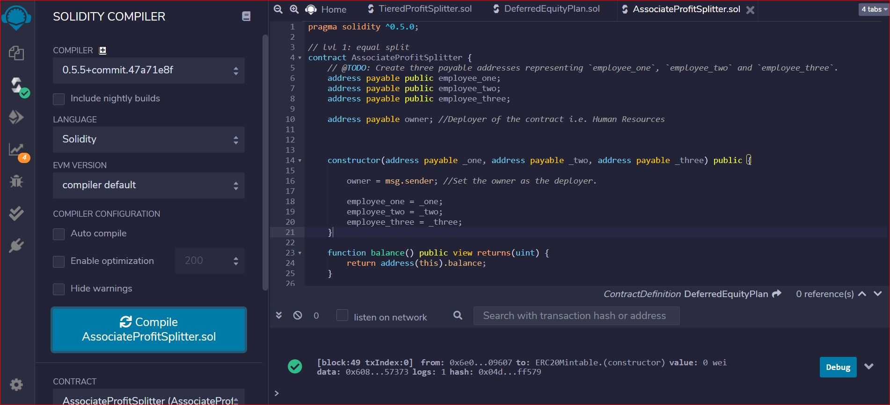
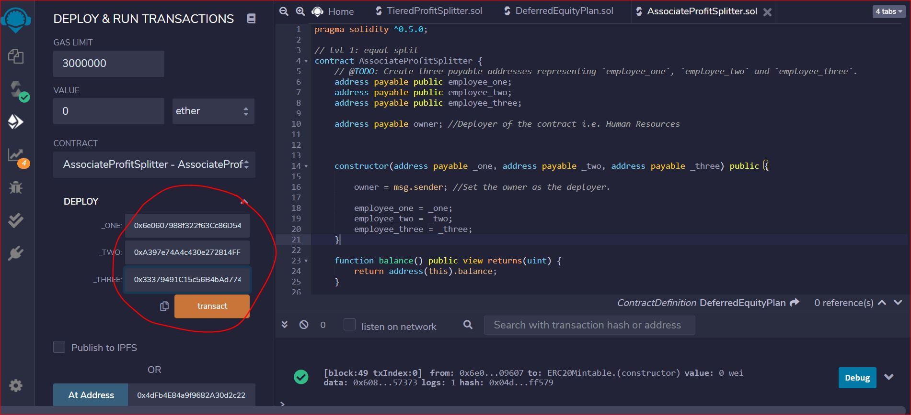
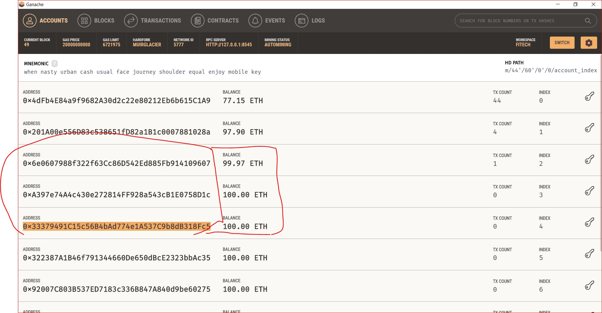
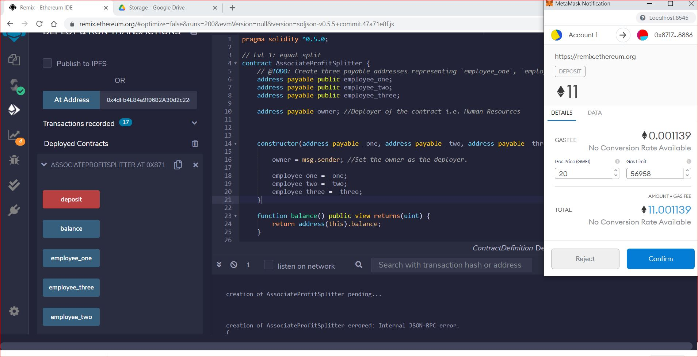
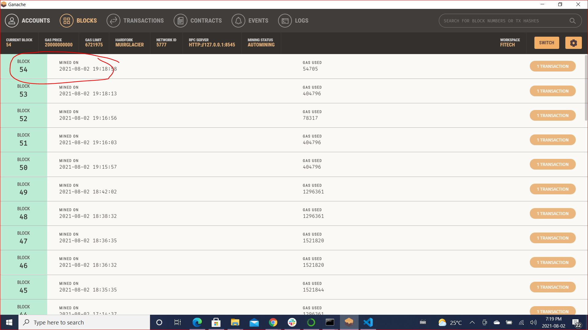
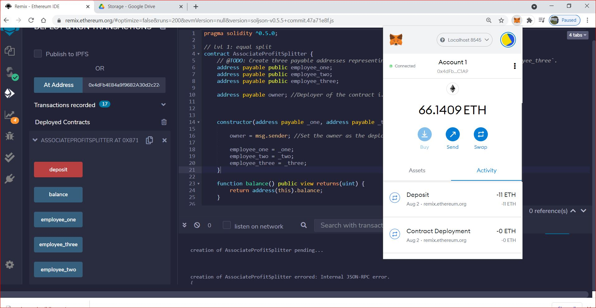

* **Level Two**TieredProfitSplitter
The Tiered Profit will distribute the tiered percentages of incoming Ether to employees at different levels. For example, the CFO gets paid 60%, CTO 25%, and Bob gets 15%.
Please view the TieredProfitSplitter.sol file . 

Address of the deployed contract:
0xC472AA5aeD42285018BfeA2257e94C320bB429d7

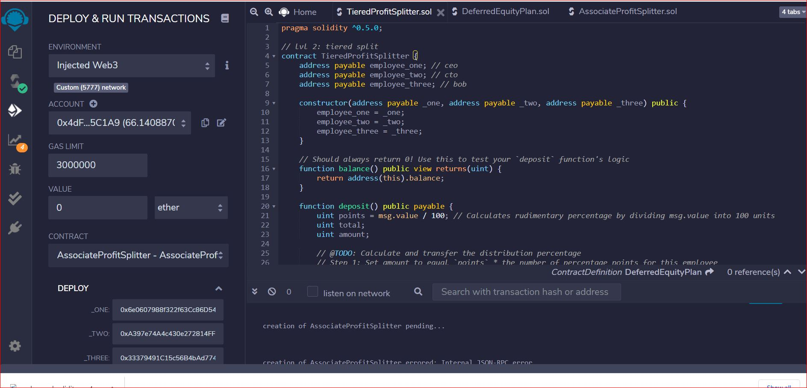
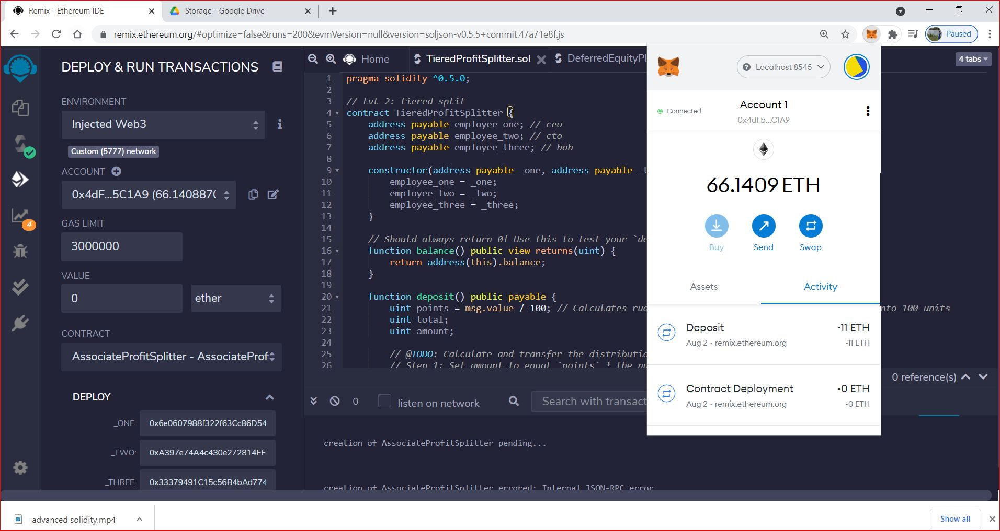
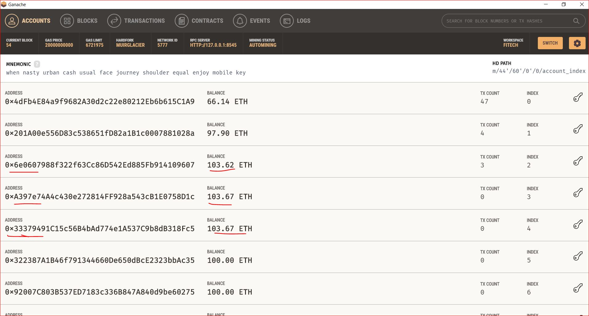
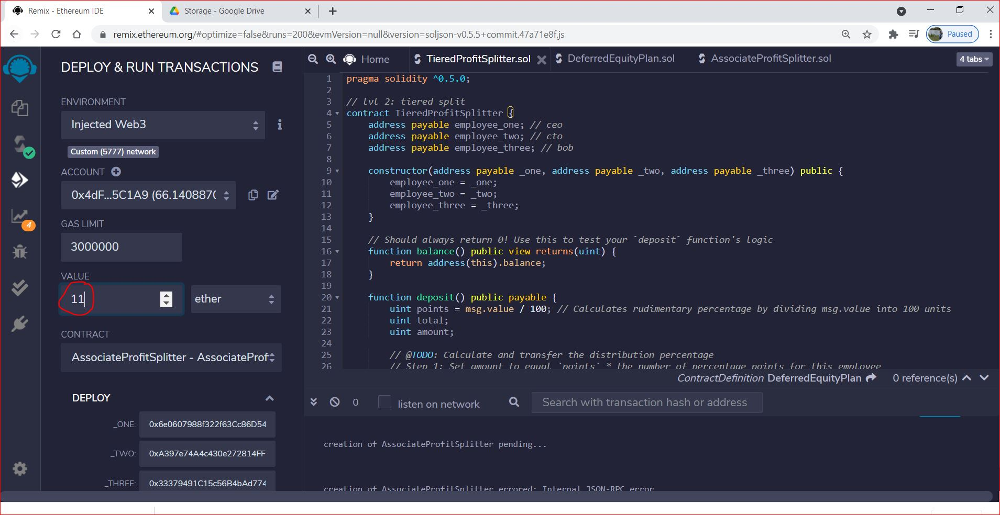
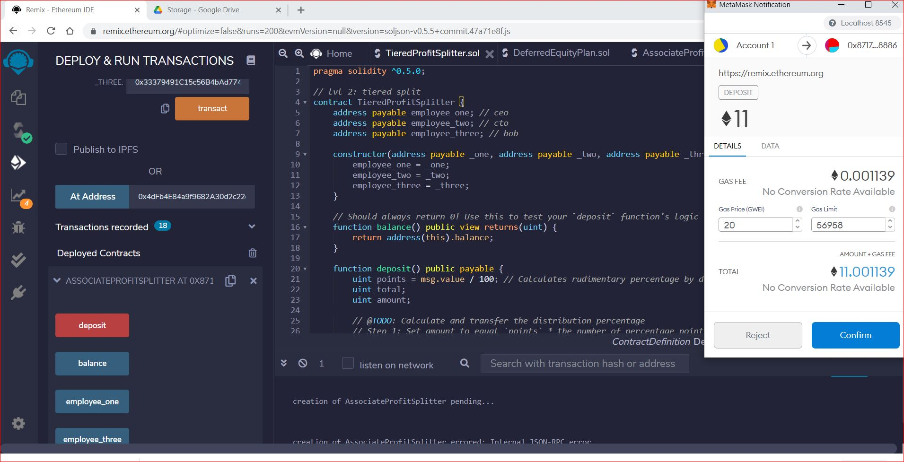
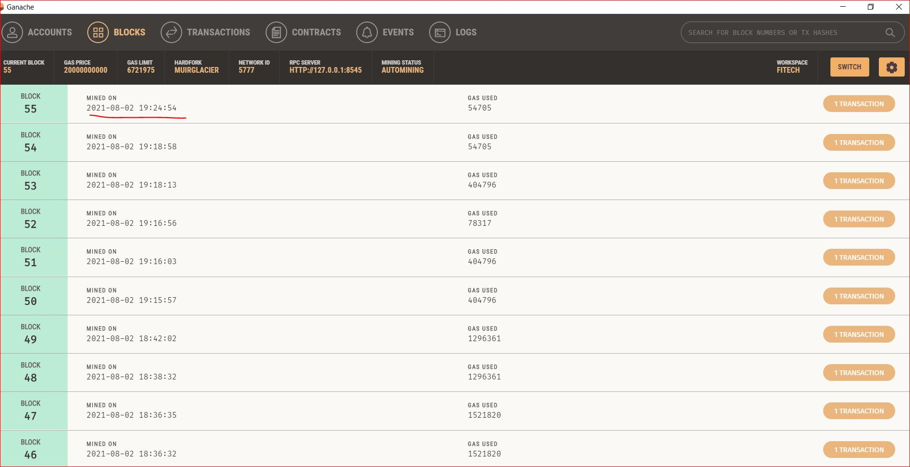
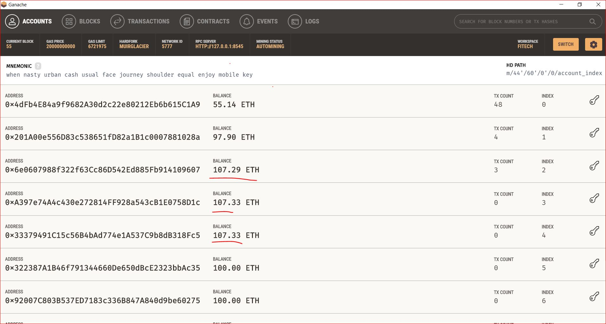

* **Level Three**DeferredEquityPlan
The Deferred Equity Plan - is used to structure traditional company stock plans. This contract will automatically manage 1000 shares with an annual distribution of 250 over 4 years for a single employee.
Please view the DeferredEquityPlan.sol file . 

Address of the deployed contract:
0x871784b75f8e96CA88D7C95aB80bBBc28FF58886

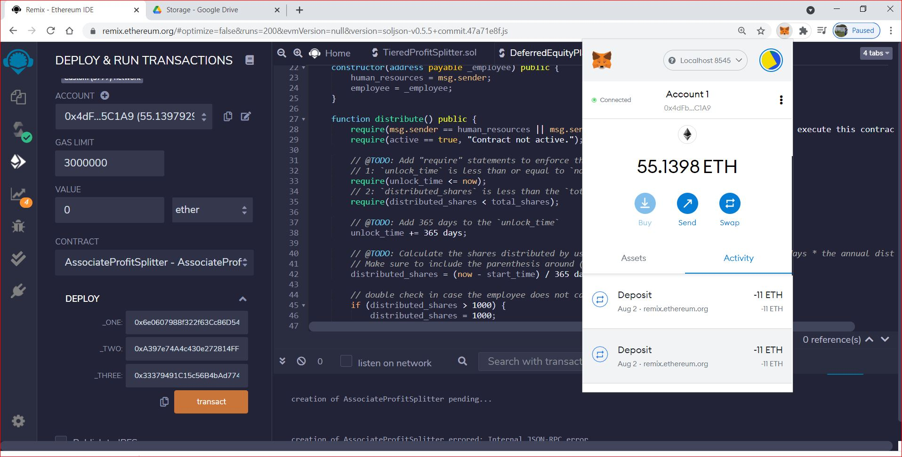
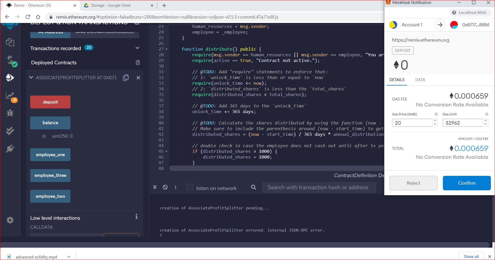
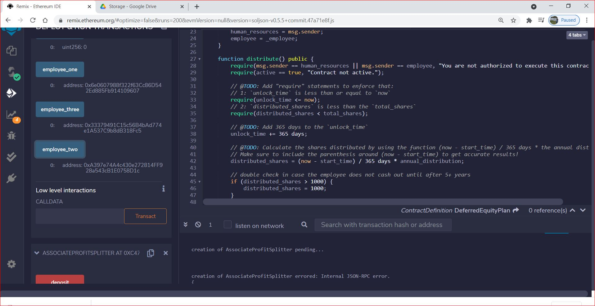
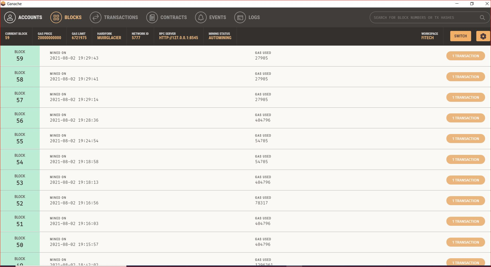

